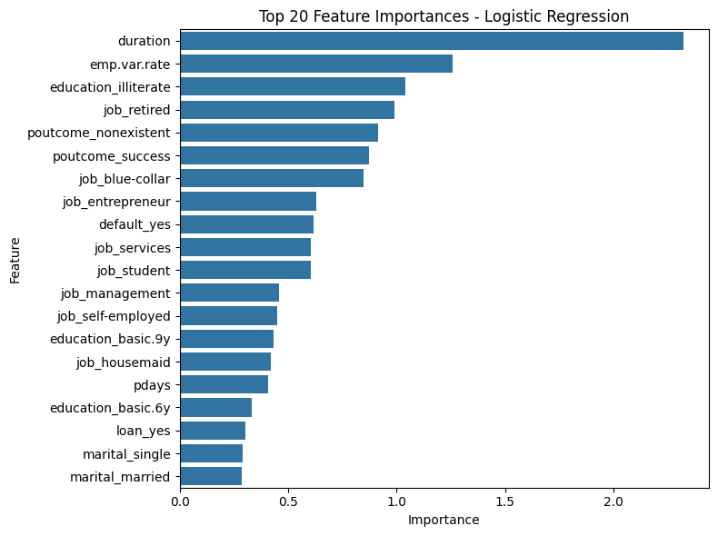

# Predictive Model for Term Deposit Subscription

## Executive Summary
The objective of this project was to develop a predictive model to identify clients likely to subscribe to a term deposit product. We evaluated four machine learning algorithms: Logistic Regression, k-Nearest Neighbors, Decision Tree, and Support Vector Machine (SVM). The SVM model emerged as the best performer based on accuracy, F1-score, and ROC-AUC metrics.

## Business Understanding
The bank aims to improve its marketing campaigns by accurately predicting which clients are likely to subscribe to a term deposit. By targeting these clients, the bank can increase subscription rates and optimize marketing resources.

## Exploratory Data Analysis (EDA)
EDA revealed significant insights into feature distributions and relationships with the target variable. Key findings included:
- Key features such as `duration`, `emp.var.rate`, and `month` showed strong predictive power.
- High correlation among some numerical features necessitated dropping highly correlated ones to avoid multicollinearity.
- The dataset was imbalanced with a higher number of 'no' responses compared to 'yes', which was addressed using SMOTE.

## Data Cleaning and Preprocessing
Steps taken:
- Removed rows with less than 5% 'unknown' values in certain categorical features.
- Label encoding was applied to ordinal features (`month`, `day_of_week`).
- Log transformation and standard scaling were applied to numerical features to handle skewness and standardize the data.
- One-hot encoding was used for categorical variables.

## Model Training and Evaluation
Several models were trained and evaluated, including Logistic Regression, k-Nearest Neighbors (kNN), Decision Tree, and SVM. Evaluation metrics included accuracy, F1 score, precision-recall AUC, and ROC AUC. Hyperparameter tuning was performed using GridSearchCV to identify the best parameters for each model.  SVM and Logistic Regression showed the best performance, with SVM slightly ahead.

**Model Performance Comparison:**

| Model                 | Train Time (s) | Train Accuracy | Test Accuracy | Train F1 | Test F1 | Best Params                                           |
|-----------------------|----------------|----------------|---------------|----------|---------|------------------------------------------------------|
| Logistic Regression   | 2.83           | 85.26%         | 81.97%        | 85.60%   | 53.51%  | {'C': 10, 'penalty': 'l2', 'solver': 'liblinear'}    |
| k-Nearest Neighbors   | 7.62           | 100.00%        | 86.53%        | 100.00%  | 44.00%  | {'metric': 'manhattan', 'n_neighbors': 1, 'weights': 'uniform'} |
| Decision Tree         | 2.84           | 98.67%         | 86.73%        | 98.68%   | 54.86%  | {'max_depth': 20, 'min_samples_leaf': 1, 'min_samples_split': 2} |
| SVM                   | 936.59         | 96.16%         | 87.27%        | 96.22%   | 56.31%  | {'C': 200, 'kernel': 'rbf'}                           |

## Feature Importance
Top features across models were:
- `duration`: Length of the last contact call.
- `emp.var.rate`: Employment variation rate.
- `month`: Month of contact.
- `education`: Client's education level.
- `job`: Type of job.

## Model Performance
- **SVM**: Highest ROC AUC (0.91), good balance in confusion matrix.
- **Logistic Regression**: Strong ROC AUC (0.90), reasonable precision-recall performance.
- **Decision Tree**: Good ROC AUC (0.78) but lower precision-recall.
- **k-Nearest Neighbors**: Lowest ROC AUC (0.67), significant misclassification.

## Findings and Actionable Items
- **Duration of calls** and **economic indicators** like `emp.var.rate` are critical in predicting client responses.
- **SVM** is recommended for deployment due to its superior performance.
- Regular retraining with new data is necessary to maintain model accuracy.

## Next Steps and Recommendations
1. **Deploy SVM** model in a production environment with monitoring.
2. **Regularly update** the model with new data to ensure it adapts to changes.
3. **Optimize computational resources** for SVM due to its longer training time.
4. **Focus marketing efforts** on clients with high predicted probabilities of subscribing.

## Conclusion
The project successfully identified the best model for predicting client subscriptions, with SVM standing out in performance. The insights gained will significantly enhance the bank's marketing strategy, leading to more efficient targeting and higher conversion rates.

## Appendices
- **Correlation Matrix**:
Provides a detailed view of the relationships between different numerical features.

- **Model Performance**:
Visual representations of model performance.

- **Feature Importances**:
Detailed charts showing the importance of various features across different models.

---

For more details on the implementation and code refer to the [Jupiter Notebook](https://github.com/vijayarulmuthu/Term-Deposit-Subscription/blob/main/notebook/practical-application-3.ipynb).
